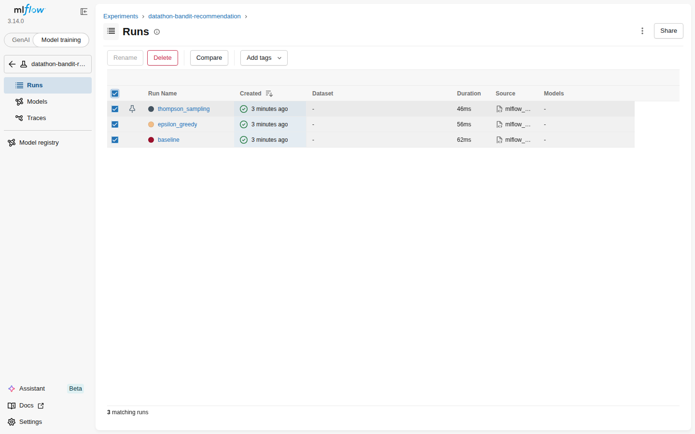
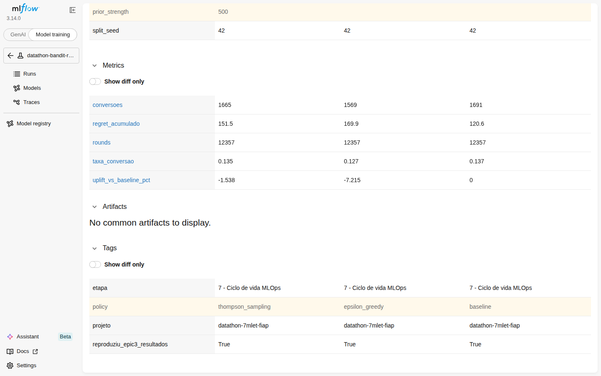

# datathon-7mlet-fiap

Plataforma de experimentação adaptativa (multi-armed bandit) para decidir, por cliente e canal digital, qual oferta, mensagem ou próximo passo apresentar — Datathon POSTECH MLET.

## Visão do problema

Instituições financeiras digitais precisam decidir, em diferentes canais, qual oferta apresentar a cada cliente elegível. Regras fixas e testes A/B longos desperdiçam tráfego e reagem lentamente a mudanças de contexto. Este projeto implementa uma abordagem adaptativa (bandit) que aprende continuamente qual oferta converte melhor, equilibrando exploração e explotação, e compara essa política contra um baseline determinístico.

O objetivo do projeto **não** é reproduzir um sistema bancário real, e sim demonstrar maturidade em ML Engineering: formulação do problema, baseline, versionamento de experimentos, serviço de inferência, avaliação e documentação de limitações/governança.

## Índice do projeto

| Etapa | Conteúdo | Status |
|-------|----------|--------|
| 0 — Organização do projeto | Repositório, dependências, README | ✅ |
| 1 — Base Kaggle e EDA | `notebooks/eda.ipynb`, link da base | ✅ |
| 2 — Preparação da base | `notebooks/preparacao_base.ipynb`, `src/features.py`, `src/arms.py` | ✅ |
| 3 — Baseline e estratégia algorítmica | Baseline vs. Thompson Sampling / Epsilon-Greedy | ✅ |
| 4 — Avaliação e casos de teste | Métricas + golden set de 5 clientes | ✅ |
| 5 — Serviço demonstrável | API FastAPI `/recommend` | ✅ |
| 6 — Arquitetura-alvo em nuvem | Parágrafo de arquitetura AWS | ✅ |
| 7 — Ciclo de vida MLOps | Tracking de experimentos via MLflow | ✅ |
| 8 — Apresentação final | Vídeo pitch (≤5 min) | ⬜ TODO |

## Estrutura do repositório

```
.
├── data/        # dados brutos e processados (Kaggle)
├── docs/        # documentação de apoio
├── models/      # artefatos de modelo/política serializados
├── notebooks/   # EDA, baseline, bandit, avaliação
└── src/         # feature engineering, definição dos braços e serviço de recomendação (API)
```

## Como executar localmente

```bash
# 1. criar e ativar o ambiente virtual
python -m venv .venv
source .venv/bin/activate  # Windows: .venv\Scripts\activate

# 2. instalar dependências
pip install -r requirements.txt

# 3. abrir os notebooks (EDA, baseline/bandit, avaliação)
jupyter notebook notebooks/

# 4. treinar/serializar as 3 políticas (gera models/*.joblib) — só precisa
#    rodar de novo se os dados ou os algoritmos de src/bandit.py mudarem
python -m src.train_policies

# 5. rodar o serviço de recomendação (Etapa 5)
uvicorn src.service:app --reload --port 8000
# docs interativos (Swagger) em http://127.0.0.1:8000/docs

# 6. logar os experimentos no MLflow e visualizar a comparação (Etapa 7)
python -m src.mlflow_tracking
mlflow ui --backend-store-uri sqlite:///mlflow.db --port 5000
# UI em http://127.0.0.1:5000
```

## Base de dados (Etapa 1)

**Base:** [Bank Marketing (henriqueyamahata)](https://www.kaggle.com/datasets/henriqueyamahata/bank-marketing) — cópia direta do [UCI Bank Marketing Dataset](https://archive.ics.uci.edu/dataset/222/bank+marketing) (Moro et al., 2014, CC BY 4.0).

- **Arquivo:** `bank-additional-full.csv`, salvo em `data/raw/bank-additional-full.csv`
- **Dimensões:** 41.188 linhas × 21 colunas (20 features + variável alvo)
- **Separador:** `;`
- **Variável alvo:** `y` (`yes`/`no` — cliente assinou depósito a prazo), usada como proxy de conversão
- **Taxa de conversão global:** ≈ 11,27% (`yes`)
- **Coluna a descartar por vazamento temporal:** `duration` (duração da última chamada só é conhecida *depois* da decisão de oferta — não pode ser usada como feature de entrada)
- **Demais colunas:** dados do cliente (`age`, `job`, `marital`, `education`, `default`, `housing`, `loan`), da campanha (`contact`, `month`, `day_of_week`, `campaign`, `pdays`, `previous`, `poutcome`) e de contexto macroeconômico (`emp.var.rate`, `cons.price.idx`, `cons.conf.idx`, `euribor3m`, `nr.employed`)

## Preparação da base e definição dos braços (Etapa 2)

**Notebook:** `notebooks/preparacao_base.ipynb` · **Código reaproveitável:** `src/features.py`, `src/arms.py`

### Feature engineering

- `duration` removida (vazamento temporal, já identificado na EDA).
- `pdays` transformada na flag binária `foi_contatado_antes` (`pdays == 999` = nunca contatado antes, ~96% da base) — evita tratar um marcador categórico como distância contínua.
- Colunas categóricas (`job`, `marital`, `education`, `default`, `housing`, `loan`, `contact`, `month`, `day_of_week`, `poutcome`) com one-hot encoding, mantendo `unknown` como categoria própria (pode carregar sinal real, conforme decidido na EDA).
- Colunas numéricas (`age`, `campaign`, `previous` e as macroeconômicas) normalizadas via `StandardScaler` (z-score).
- Dataset final: 63 colunas (após one-hot), sem valores nulos.

### Definição dos braços simulados (bandit)

O dataset `bank-marketing` tem um único produto real (depósito a prazo), sem múltiplas ofertas. Para satisfazer o requisito de "braços" do bandit, foram simulados **4 braços** = variações de mensagem/canal para essa mesma oferta — **limitação assumida e documentada**, não um dado real apresentado como tal:

| Braço | Nome | Multiplicador-base | Segmento com boost |
|-------|------|---------------------|----------------------|
| 0 | Oferta padrão | 1,00 | — (referência histórica) |
| 1 | Oferta com apelo a benefício/taxa | 1,10 | job admin./management/technician ou educação superior |
| 2 | Oferta reforçada para quem já converteu | 1,00 | `poutcome == success` (forte) ou `previous > 0` (moderado) |
| 3 | Oferta introdutória (primeiro contato) | 0,85 | nunca contatado antes, estudante/aposentado, meses mar/dez/set/out |

**Regra de probabilidade:** `p_arm(cliente) = clip(p_global × multiplicador_base × multiplicador_segmento + ruído_gaussiano(0, 0,02), 0.01, 0.95)`, onde `p_global` é a taxa de conversão real do dataset (≈ 11,27%) e os multiplicadores de segmento são ancorados em sinais reais encontrados na EDA (poutcome, job, mês, contato prévio). Seed fixa (42) garante reprodutibilidade. Checagem de sanidade no notebook confirma que os braços diferenciam por contexto (ex.: `p_arm_2` sobe de ~11,4% para ~15,2% no segmento `poutcome=success`) — não existe braço universalmente melhor para todos os clientes.

### Split treino vs. simulação online

Sem coluna de ano na base (só `month`/`day_of_week`), um split temporal estrito não é confiável — por isso foi usado um **split aleatório estratificado por `y`** (70% treino / 30% simulação online, seed=42), preservando a taxa de conversão global em ambos os conjuntos.

### Dataset processado (`data/processed/`)

- `train.csv` (28.831 linhas) e `online_sim.csv` (12.357 linhas) — features + target
- `arm_probabilities_train.csv` / `arm_probabilities_online.csv` — probabilidade simulada por braço (`p_arm_0`..`p_arm_3`), alinhada linha a linha com os CSVs acima
- `arms_definition.json` — metadata dos braços (nome, descrição, multiplicador-base, seed, ruído)

## Baseline e estratégia algorítmica (Etapa 3)

**Notebook:** `notebooks/baseline_bandit.ipynb` · **Código reaproveitável:** `src/bandit.py`

### Segmentação de contexto

Como o dataset não tem múltiplos produtos reais, o "contexto" do Thompson Sampling é uma segmentação simplificada do cliente (`segment_customer`, em `src/bandit.py`), construída com os mesmos sinais que definem os 4 braços simulados (Etapa 2): `poutcome`, `job`/`education`, `pdays`/`month`. 4 segmentos mutuamente exclusivos, em ordem de prioridade: `poutcome_success` (já converteu antes, ~3% da base), `novo_contato_qualificado` (nunca contatado + perfil/mês favorável, ~8%), `perfil_qualificado` (cargo/educação qualificados, ~52%) e `padrao` (~36%).

### Baseline determinístico

Calculado a partir dos 28.831 clientes de treino: sempre oferece o braço de maior conversão média histórica, sem se adaptar. O braço 1 ("Oferta com apelo a benefício/taxa") vence com **≈13,46%** de conversão média — seu multiplicador-base (1,10) já é o maior entre os 4 braços, o que faz dele o "melhor geral" mesmo antes de considerar qualquer segmento.

### Thompson Sampling contextual simplificado

Beta-Bernoulli por (segmento, braço). Prior por *warm start*: a probabilidade média simulada de cada (segmento, braço) no treino vira `(alpha0, beta0)` via pseudo-observações `k = min(n_clientes_do_segmento, 500)` — a força do prior é proporcional ao histórico real disponível, com um teto para preservar capacidade de adaptação online. Uma ablação no notebook confirma que esse prior informado é necessário: com prior uninformado (`Beta(1,1)`), o Thompson Sampling fica **abaixo** do Epsilon-Greedy durante toda a simulação; com o warm start, passa a superá-lo de forma consistente.

### Epsilon-Greedy (comparação)

Política adaptativa não contextual, com `epsilon = 0,10` fixo — 10% dos rounds são exploração aleatória, para sempre, o que evidencia o trade-off exploração/conversão pedido no PDF (o Thompson Sampling explora via a incerteza do posterior, que diminui com o tempo; o Epsilon-Greedy paga um custo constante).

### Simulação online e resultado comparativo

Simulação sequencial dos 12.357 clientes de `online_sim.csv`, com recompensa Bernoulli amostrada da probabilidade verdadeira simulada do braço escolhido. Resultado (métrica esperada, sem ruído de sorteio):

| Política | Conversão esperada | vs. baseline |
|---|---|---|
| Baseline determinístico | 13,47% | — |
| Epsilon-Greedy (ε=0,10) | 13,07% | -2,97% |
| Thompson Sampling contextual | 13,22% | -1,86% |
| Oráculo contextual (conhece o melhor braço por segmento) | 13,52% | +0,36% |

**Achado central (documentado, não maquiado):** nem o Thompson Sampling nem o Epsilon-Greedy superam o baseline neste horizonte de ~12 mil rounds — mas o Thompson Sampling é consistentemente melhor que o Epsilon-Greedy. Três motivos verificados nos dados: (1) o baseline foi estimado com uma amostra de treino grande (28.831 clientes), então já "nasce" quase ótimo; (2) o ambiente simulado tem pouca heterogeneidade entre braços — mesmo um oráculo contextual perfeito ganharia só 0,05 ponto percentual sobre o baseline, porque o braço 1 já é o melhor em 3 dos 4 segmentos; (3) explorar tem custo real, e esse custo supera o ganho potencial (muito pequeno) dentro do horizonte simulado. Isso resolve a lacuna crítica sinalizada no `PLANO_DATATHON.md` (Seção 1.7): o bandit não bate o baseline aqui não por erro de implementação, mas porque o ambiente simulado (poucos braços, baixa heterogeneidade) deixa pouco espaço para ganho por contextualização — um resultado honesto sobre quando um bandit compensa (baixa confiança prévia, ambiente não-estacionário, maior heterogeneidade entre braços) e quando não compensa.

Resultados completos (priors, taxas históricas, métricas da simulação) salvos em `data/processed/epic3_resultados.json`.

## Avaliação e casos de teste (Etapa 4)

**Notebook:** `notebooks/avaliacao_golden_set.ipynb` · **Resultados:** `data/processed/epic4_resultados.json`

Este notebook não re-treina nada: ele reproduz o pipeline exato da Etapa 3 (mesmo split, mesmos priors, mesma simulação online) para chegar ao mesmo estado final treinado das 3 políticas, e avalia esse estado com mais rigor — quebra por segmento e teste de significância — além de gerar o golden set exigido pelo checklist.

### Métricas de avaliação por segmento

A conversão *realizada* (sorteio Bernoulli) tem ruído de amostragem, principalmente em segmentos pequenos (`poutcome_success` tem só 383 rounds). O `chosen_prob` médio (probabilidade verdadeira simulada do braço escolhido) e o regret derivado dele são determinísticos dado o braço escolhido — por isso são a leitura mais confiável por segmento:

| Segmento (share do tráfego) | Baseline | Epsilon-Greedy | Thompson Sampling |
|---|---|---|---|
| `poutcome_success` (3,1%) — regret médio | 0,0223 | 0,0207 | **0,0120** |
| `novo_contato_qualificado` (8,5%) — regret médio | **0,0150** | 0,0170 | 0,0189 |
| `perfil_qualificado` (52,5%) — regret médio | **0,0054** | 0,0113 | 0,0067 |
| `padrao` (35,9%) — regret médio | **0,0137** | 0,0159 | 0,0189 |

**Leitura:** o Thompson Sampling só bate o baseline (regret menor) no segmento em que seu prior genuinamente discorda do baseline — `poutcome_success`, onde reduz o regret médio praticamente à metade. Nos outros 3 segmentos o próprio prior do TS já esperava o braço 1 como melhor (a mesma aposta do baseline), então ele só paga o custo extra de explorar sem ganhar informação nova. Isso decompõe, no nível de segmento, o achado agregado da Etapa 3: contextualizar ajuda exatamente onde há heterogeneidade real entre braços (3,1% do tráfego), mas custa exploração nos 96,9% restantes, onde o baseline já nasce ótimo.

### O achado da Etapa 3 é estatisticamente significativo?

Teste de significância (bootstrap com 5.000 réplicas + teste z de duas proporções) sobre a conversão realizada, comparando cada política adaptativa contra o baseline:

| Comparação | Uplift médio | IC 95% | Cobre zero? | p-valor |
|---|---|---|---|---|
| Thompson Sampling vs. baseline | -1,50% | [-7,55%, +4,87%] | **Sim** | 0,63 |
| Epsilon-Greedy vs. baseline | -7,20% | [-13,16%, -1,12%] | Não | 0,02 |

**Leitura (ajusta a certeza do achado da Etapa 3, não o contradiz):** a diferença Thompson Sampling vs. baseline **não é estatisticamente significativa** neste horizonte de simulação — os dados não permitem afirmar com confiança que o baseline realmente converte mais; podem estar empatados na prática. Já a diferença do Epsilon-Greedy **é significativa** — o custo de exploração fixa (`epsilon=0,10`, sem decaimento) é real, não ruído. O achado que sobrevive ao rigor estatístico é: o Epsilon-Greedy perde de forma mensurável, mas o Thompson Sampling está estatisticamente empatado com o baseline enquanto aprende com muito menos custo de exploração — e ainda ganha, de forma clara, no único segmento em que tem informação genuína para explorar.

### Golden set de 5 clientes

Critério de seleção documentado (não sorteio): 1 cliente por segmento de contexto + 1 caso de borda, todos extraídos de `online_sim.csv`.

| # | Caso | Segmento | Recomendação — Baseline | Epsilon-Greedy | Thompson Sampling |
|---|------|----------|--------------------------|-----------------|---------------------|
| 1 | Já converteu antes (`poutcome=success`) | `poutcome_success` | Braço 1 (apelo a benefício) | Braço 1 (apelo a benefício) | **Braço 2 (reforço p/ quem já converteu)** |
| 2 | Aposentado, nunca contatado | `novo_contato_qualificado` | Braço 1 | Braço 1 | Braço 1 |
| 3 | Gestão + educação superior | `perfil_qualificado` | Braço 1 | Braço 1 | Braço 1 |
| 4 | Sem sinal especial, nunca contatado | `padrao` | Braço 1 | Braço 1 | Braço 1 |
| 5 | Caso de borda: contatado antes, sem sucesso (`poutcome=failure`) | `padrao` | Braço 1 | Braço 1 | Braço 1 |

**Sanity check:** em 4 dos 5 casos as 3 políticas concordam — sinal de robustez, a recomendação não depende de qual algoritmo está servindo. O único desacordo (caso 1) é exatamente o que o desenho da Etapa 2/3 previa: só o Thompson Sampling usa o contexto para perceber que, para um cliente que já converteu antes, reforçar a mensagem que já funcionou vale mais que a mensagem genérica de benefício — e é o resultado concreto, em nível de cliente individual, de por que vale contextualizar mesmo com ganho agregado pequeno. O caso 5 confirma a decisão de design da Etapa 3 de não abrir um segmento próprio para "contato anterior sem sucesso": o boost moderado que esse sinal dá ao braço 2 não é suficiente para superar o braço 1, e as 3 políticas concordam nisso.

Features completas, probabilidades por braço e justificativa detalhada de cada um dos 5 casos estão no notebook e em `data/processed/epic4_resultados.json`.

## Serviço de recomendação (Etapa 5)

API FastAPI que serve as 3 políticas já treinadas/avaliadas nas Etapas 3 e 4
(`baseline`, `epsilon_greedy`, `thompson_sampling`), em modo "servir"
determinístico — sem o termo de exploração aleatória usado só durante o
treino (a mesma regra da Seção 3 de `notebooks/avaliacao_golden_set.ipynb`):

- **`baseline`** → sempre o braço de maior conversão média histórica no treino.
- **`epsilon_greedy`** → `argmax(estimated_rates)` pós-treino (não é contextual — não varia por cliente).
- **`thompson_sampling`** → `argmax(posterior_means)` do segmento do cliente — é a única política que muda a recomendação conforme o perfil do cliente, e é a **recomendação primária** do serviço (`recomendacao_primaria`), por ser o algoritmo adaptativo principal do projeto (Seção 1.5 do `PLANO_DATATHON.md`).

### Arquivos

| Arquivo | Papel |
|---------|-------|
| `src/train_policies.py` | Reproduz o pipeline de treino da Etapa 3/4 (mesmos seeds/priors) e serializa as 3 políticas treinadas em `models/*.joblib` (`joblib`). Confere automaticamente que reproduz `data/processed/epic3_resultados.json` antes de salvar. |
| `src/service.py` | App FastAPI (`POST /recommend`, `GET /arms`, `GET /health`). Carrega os `.joblib` de `models/` no startup. |
| `tests/test_golden_set.py` | Testa o endpoint com os 5 clientes do golden set da Etapa 4 e confere que a recomendação bate exatamente com `data/processed/epic4_resultados.json`. |
| `Dockerfile` | Imagem que treina as políticas no build e sobe o serviço (opcional — Task 5.1.4). |

### Como rodar

```bash
python -m src.train_policies          # gera models/*.joblib (uma vez, ou quando os dados/algoritmos mudarem)
uvicorn src.service:app --reload --port 8000
python -m pytest tests/test_golden_set.py -v   # valida contra o golden set da Etapa 4
```

### Exemplo — request/response

Cliente 1 do golden set (`poutcome_success`), o único caso em que as 3
políticas discordam:

```bash
curl -X POST http://127.0.0.1:8000/recommend \
  -H "Content-Type: application/json" \
  -d '{
    "age": 27, "job": "unknown", "marital": "single",
    "education": "university.degree", "housing": "yes", "loan": "no",
    "contact": "cellular", "month": "jun", "pdays": 3, "previous": 2,
    "poutcome": "success"
  }'
```

```json
{
  "segmento": "poutcome_success",
  "p_arm_simulado": {"p_arm_0": 0.1127, "p_arm_1": 0.1425, "p_arm_2": 0.1521, "p_arm_3": 0.0958},
  "recomendacoes": {
    "baseline": {"arm": 1, "nome": "Oferta com apelo a benefício/taxa", "descricao": "..."},
    "epsilon_greedy": {"arm": 1, "nome": "Oferta com apelo a benefício/taxa", "descricao": "..."},
    "thompson_sampling": {"arm": 2, "nome": "Oferta reforçada para quem já converteu", "descricao": "..."}
  },
  "recomendacao_primaria": "thompson_sampling",
  "politicas_concordam": false
}
```

Só os campos `job`, `education`, `poutcome`, `previous`, `pdays` e `month`
determinam o segmento (e portanto a recomendação do Thompson Sampling) — ver
`src/bandit.segment_customer`. Os demais campos do payload (`age`, `marital`,
`housing`, `loan`, `contact`) são aceitos para compor um cliente realista
(mesmo formato do golden set), mas não influenciam a decisão de nenhuma das
3 políticas.

### Validação

Os 5 casos de `tests/test_golden_set.py` passam e reproduzem exatamente as
recomendações calculadas em `notebooks/avaliacao_golden_set.ipynb` (Etapa 4):
em 4 dos 5 casos as 3 políticas concordam (braço 1); o único desacordo
(cliente `poutcome_success`, Thompson Sampling recomenda o braço 2) é
reproduzido pela API sem alteração.

**Nota:** o `Dockerfile` foi escrito seguindo as boas práticas padrão (build
Python slim + `pip install` + `train_policies` no build), mas não foi testado
com `docker build` neste ambiente por falta de daemon Docker disponível — vale
validar o build localmente antes de usá-lo como evidência na Etapa 8.

## Arquitetura-alvo em nuvem (Etapa 6)

Este projeto roda localmente (notebooks + o serviço FastAPI da Etapa 5), mas foi desenhado pensando em como rodaria em produção. A referência de nuvem escolhida é a **AWS** (Seção 1.5/2.2 do `PLANO_DATATHON.md`):

> Em produção, os dados brutos e versionados do Kaggle seriam armazenados no **Amazon S3** (camada raw/processed), com o pipeline de EDA e feature engineering orquestrado por um job agendado (ex. **AWS Glue** ou um container batch no **ECS Fargate**). O treinamento e a comparação entre baseline e política adaptativa rodariam sob **Amazon SageMaker Training Jobs**, com **MLflow** apontando para um backend de tracking no S3/RDS para versionar experimentos, parâmetros e métricas. O modelo/política aprovado seria publicado como endpoint via **SageMaker Endpoint** ou como container **FastAPI em ECS Fargate** atrás de **API Gateway**, com autenticação via **IAM**/API keys. Observabilidade e risco operacional seriam cobertos por **CloudWatch** (logs, métricas de latência/erro) e alarmes para taxa de exploração e conversão fora do esperado. Decisões sensíveis manteriam humano no loop via um passo de aprovação antes de qualquer expansão de braços/ofertas, e o versionamento de dados seguiria política de minimização e retenção documentada.

### Mapeamento — o que existe hoje vs. o que rodaria em produção

| Componente do pipeline | O que existe hoje (local) | Equivalente na AWS |
|-------------------------|---------------------------|---------------------|
| Dados brutos/processados | `data/raw/`, `data/processed/` | **S3** (camadas raw/processed) |
| EDA e feature engineering | `notebooks/eda.ipynb`, `src/features.py` | **AWS Glue** ou job batch em **ECS Fargate** |
| Treino/comparação de políticas | `src/train_policies.py` | **SageMaker Training Jobs** |
| Tracking de experimentos | MLflow local (Etapa 7) | **MLflow** com backend S3/RDS |
| Serviço de recomendação | `src/service.py` (FastAPI local, Etapa 5) | **SageMaker Endpoint** ou FastAPI em **ECS Fargate** atrás de **API Gateway** |
| Observabilidade | logs do `uvicorn` | **CloudWatch** (logs, latência, alarmes de taxa de exploração/conversão) |

### Por que não implantar de fato na AWS (trade-off registrado, Seção 2.3 do plano)

O desafio exige uma solução "demonstrável", não uma implantação real — deploy de fato na AWS consome dias de um cronograma solo sem agregar nota (o peso está em código + modelo + MLflow + demo). Por isso o serviço da Etapa 5 roda local (FastAPI), e a arquitetura AWS fica documentada, não implantada — o que está dentro do escopo explicitamente permitido pelo desafio (Seção 1.3 do `PLANO_DATATHON.md`, "fora do escopo: infraestrutura cloud realmente provisionada").

## Ciclo de vida MLOps (Etapa 7)

**Código:** `src/mlflow_tracking.py`

Esta etapa não re-treina nada: ela reaproveita `models/training_metadata.json` (gerado por `src/train_policies.py`, Etapa 5) como fonte única de params e métricas, e apenas os registra no MLflow — 1 run por política (`baseline`, `epsilon_greedy`, `thompson_sampling`), dentro do mesmo experimento, para permitir comparar os 3 lado a lado na MLflow UI.

### Configuração (Task 7.1.1)

Tracking URI local, em arquivo único: `sqlite:///mlflow.db` na raiz do repositório. O "file store" clássico do MLflow (diretório `mlruns/` sem banco) está em modo de manutenção a partir do MLflow 3.x (aviso oficial recomendando migrar para um backend em banco) — por isso foi usado SQLite em vez dele, mas o espírito é o mesmo da decisão fechada na Seção 1.5 do `PLANO_DATATHON.md` ("MLflow localmente"): um único arquivo local, sem servidor remoto/managed, adequado para um grupo solo. `mlflow.db` fica fora do controle de versão (`.gitignore`) — é reproduzível a qualquer momento rodando `python -m src.mlflow_tracking`, assim como `models/*.joblib` é reproduzível via `train_policies.py`.

### Params e métricas logados (Tasks 7.1.2–7.1.3)

| Escopo | Nome | Origem |
|---|---|---|
| Comum às 3 políticas | `split_seed`, `online_sim_size`, `online_sim_seed`, `n_rounds_treinados`, `p_global_treino` | `models/training_metadata.json` |
| Só `epsilon_greedy` | `epsilon`, `epsilon_greedy_seed` | idem |
| Só `thompson_sampling` | `prior_strength` | idem |
| Métricas (as 3 políticas) | `rounds`, `conversoes`, `taxa_conversao`, `regret_acumulado`, `uplift_vs_baseline_pct` | `models/training_metadata.json` → `resumo_geral` (mesmos números de `data/processed/epic3_resultados.json`) |
| Tags | `projeto`, `etapa`, `policy`, `reproduziu_epic3_resultados` | fixas/derivadas da metadata |

### Comparação de runs na MLflow UI (Task 7.1.4)

Os 3 runs registrados no experimento `datathon-bandit-recommendation`:



Comparação lado a lado (params, métricas e tags) — a linha `policy` identifica cada coluna (`thompson_sampling`, `epsilon_greedy`, `baseline`, nessa ordem), e os números batem exatamente com a tabela da Seção "Simulação online e resultado comparativo — Etapa 3" acima:



### Como rodar

```bash
python -m src.mlflow_tracking                                     # loga os 3 runs (idempotente — cria novos runs a cada execução)
mlflow ui --backend-store-uri sqlite:///mlflow.db --port 5000      # UI em http://127.0.0.1:5000
```

## Governança e uso de dados

Este projeto usa exclusivamente dados públicos do Kaggle, sem dados reais de clientes, identificadores, patrimônio, renda, gênero ou raça. Decisões de oferta mantêm humano no loop antes de qualquer expansão de braços, e o uso dos dados segue princípios de minimização e retenção mínima necessária para fins educacionais deste desafio.

## Apresentação final (Etapa 8)

*A preencher: link do vídeo pitch (≤5 min).*
